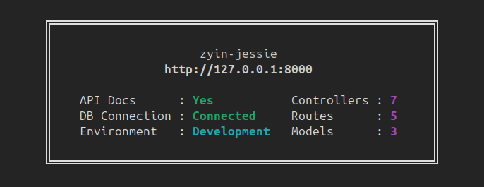

<div align="center">
    <a href="./public/banner.png" target="_blank">
        
    </a>
</div>

# ExpressJS Backend Boilerplate

A ready-to-use Express.js boilerplate for fast API development, with essential configurations for security, environment variables, and database integration.

## Features

- **Express.js**: Fast, unopinionated, minimalist web framework
- **Security Measures**:
  - Secure cookies
  - Helmet security headers
  - XSS protection
  - CORS configuration
- **Authentication**: Token-based authentication with encrypted payloads
- **Request Validation**: Using express-validator
- **Middleware**:
  - CORS
  - URL Parser
  - Cookie Parser
  - Authentication
  - Security headers
  - Role-based access control
- **Environment Configuration**: Development
- **API Response Format**: Standardized API response format

## Prerequisites

- Node.js (v16+)
- Node Package Manager (NPM)
- MongoDB

## Installation

1. Clone the repository:

   ```bash
   git clone https://github.com/zyin-jessie/express-boilerplate.git
   ```
   ```bash
   cd express-boilerplate
   ```

2. Install dependencies:

   ```bash
   npm install
   ```

3. Configure environment variables:
   ```bash
   cp .env.example .env
   # Edit .env with your configuration values
   ```

## Environment Variables

Create a `.env` file for development variables:

```
PORT=                   # Application port
DATABASE_URI=           # Your database connection string
FRONTEND_URL=           # Your frontend URL
```

## Project Structure

```
├── public/                    # Static assets
├── src/    
│   ├── config/                # Application configuration files
│   │   └── dbConnection.js    # MongoDB connection setup
│   ├── controllers/           # Handlers for HTTP requests
│   ├── lib/                   # Core helper libraries
│   │   ├── bcrypt.js          # Password hashing functions
│   │   └── swagger.js         # Swagger API documentation
│   ├── middleware/            # Express middleware functions
│   │   ├── verifyAuthToken.js # Middleware for verifying JWT tokens
│   │   ├── cors.ts            # CORS configuration
│   ├── models/                # Database models
│   ├── routes/                # Route definitions
│   ├── utils/                 # Utility functions
│   ├── index.ts               # Server entry point
├── .env                       # Development environment variables
├── .env.example               # Example environment variables
├── .gitignore                 # Git ignore file (e.g., node_modules, .env)
├── .prettierignore            # Files to ignore for Prettier formatting
├── .prettierrc.json           # Prettier configuration file
├── .package-lock.json         # Lock file to track exact package versions
├── .package.json              # Project's package metadata and dependencies
└── README.md                  # Project overview and setup instructions
```

## Usage

### Development

```bash
npm run dev
```

This starts the development server with hot-reload using nodemon.

### Production

```bash
npm run start
```

This runs the code for production, applies necessary optimizations, and minifies the code for better performance.

## License

<a aria-label="License" href="https://github.com/zyin-jessie/express-boilerplate"></a>

## Author

zyin-jessie